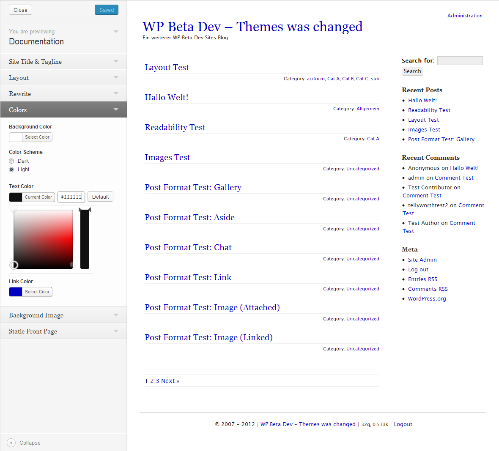

# Documentation
A small theme for WordPress as a documentation-tool.
The focus was on text, customization and responsive tables for view data in different screens.

* *old theme, but maintained ;) Developed since 2007*

## Description
A theme with simple structure, different settings and possibilities with the focus to documentize a topic with WordPress.
The supports custom settings for background, header, text- and link color and different more. It is possible to set the settings on frontend with the possibilities of the theme *Customizer* in WordPress.

or the see the [small video](https://vimeo.com/51533540) about the customizer on this theme.

## Installation
### Requirements
* WordPress (also Multisite) version 3.4 and later (tested at 4.9)
* PHP 5.2*

## Other Notes
### Supports the Theme Hook Alliance
**What? Why?**
Please see the description to this project on [github.com/zamoose/themehookalliance](https://github.com/zamoose/themehookalliance)

### License
Good news, this theme is free for everyone! Since it's released under the GPL, you can use it free of charge on your personal or commercial blog.

### Contact & Feedback
The theme is developed current by me ([Frank Bültge](https://bueltge.de))

Please let me know if you like the theme or you hate it or whatever ... Please fork it, add an issue for ideas and bugs.

### Disclaimer
I'm German and my English might be gruesome here and there. So please be patient with me and let me know of typos or grammatical faults. Thanks